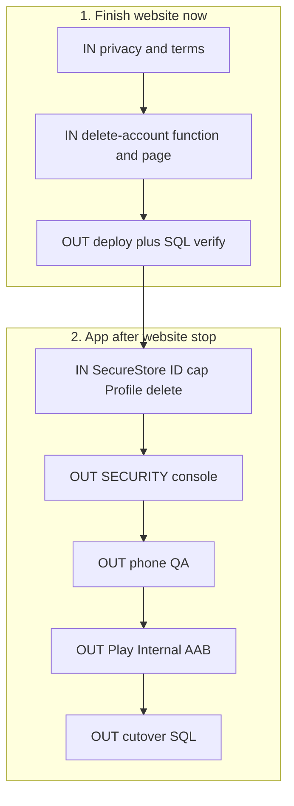

# Remaining work — website first, then app

Same plan as [`unideals-app/REMAINING_WORK.md`](../unideals-app/REMAINING_WORK.md). Read this so you do not mix old checklists.

**IN** = code in a repo. **OUT** = Supabase / Vercel / Play / crawlers.

Do **website steps 1–6**, then **stop website features**. Then open the app folder for steps 7–16.

Do **not** run `supabase_reveal_deal_code_cutover.sql` until a Play-store install Reveals an online code.

Older docs (history, not the queue):

- [WEBSITE_PARITY_PLAN.md](WEBSITE_PARITY_PLAN.md) — product features; code is done
- [LAUNCH_HARDENING_PLAYBOOK.md](LAUNCH_HARDENING_PLAYBOOK.md) — batches A–D code is done; cutover still waits on Play

---

## 1. Website — finish now (`unideals`)

### IN

- [x] **1. Privacy + terms copy** in `src/pages/PrivacyPolicy.jsx` and `src/pages/TermsOfService.jsx`
  - ID document storage (private bucket, short-lived signed URLs)
  - Partner scanner **camera**
  - App **push** tokens
  - GA4 + Clarity (already mentioned on privacy)
  - **13+ / not designed for under-13**
  - Real deletion path (not “email support only”)
  - Contact stays `unideals.lk@gmail.com`
- [x] **2. Delete-account Edge Function** (same auth pattern as `send-verification-otp`)
  - Verify caller JWT with the anon client
  - `auth.admin.deleteUser` with the **service role** (never in Vite env)
  - Delete **only** the caller’s `auth.getUser()` id
  - Remove leftover rows/files Auth does not cascade: `verification-documents/{uid}/`, `user_roles`, tickets
- [x] **3. Public page `/delete-account`** (Play needs a URL that opens **without** the app)
  - Signed-in: confirm, call the function, sign out
  - Signed-out: sign in, then delete
  - Link from Privacy “Your Rights” and Footer
  - Route in `src/App.jsx`
  - Optional: same control on Profile

### OUT

- [x] **4.** Deploy: `npx supabase functions deploy delete-account` (use the real function name)
- [x] **5.** Verify live SQL / env once. Do **not** re-run old instant-verify SQL.
  - [x] `verification-documents` bucket is **private**
  - [x] Admin-gate live (OTP does **not** set `is_verified`)
  - [x] `supabase_reveal_deal_code.sql` applied (already done)
  - [x] `supabase_hide_finished_listings.sql` live
  - [x] Yearly verification + push + webhook HTTP SQL if not applied
  - [x] Auth allowlist: `https://www.unideals.co/auth/callback`, `http://localhost:5173/auth/callback`, `unideals://auth/callback`
  - [x] Vercel Production: `VITE_SUPABASE_*`. GA4 `G-V1KKPJDS91` and Clarity `ybcb02nvec` are **already live**. Do **not** create new analytics accounts.
- [ ] **6.** Do **not** run [`supabase_reveal_deal_code_cutover.sql`](supabase_reveal_deal_code_cutover.sql)

**Website stop.** Playbook A–D and parity phases 0–4 are already in the tree.

---

## 2. App — after website stop (`unideals-app`)

Do **not** rebuild Reveal, Explore brands, or a new AAB unless native/config changed.

Details: [LAUNCH.md](../unideals-app/LAUNCH.md), [SECURITY.md](../unideals-app/SECURITY.md), [PLAY_STORE.md](../unideals-app/PLAY_STORE.md), [md/REVEAL_PROMO_CODE.md](../unideals-app/md/REVEAL_PROMO_CODE.md).

### IN

- [ ] **7.** Sync `unideals-app/src/lib/legalContent.ts` with website privacy/terms (same 13+, camera, push, `https://www.unideals.co/delete-account`)
- [ ] **8.** **SecureStore** for the Supabase session (replace AsyncStorage in `src/lib/supabase.ts`)
- [ ] **9.** **Cap ID upload** size/type in `src/lib/verificationDocuments.ts`
- [ ] **10.** **Profile delete account** — same Edge Function as the website; Sign out stays separate

### OUT

- [ ] **11.** [SECURITY.md](../unideals-app/SECURITY.md) live checks: private ID bucket; student JWT cannot read `deals.redemption_code` from the table, others’ IDs/tickets, admin RPCs; Edge Function gates; production Auth redirects `unideals://` only if Expo Go is not needed
- [ ] **12.** Phone QA on a **preview APK** (not Play): login / Google / reset, ID verify, **Online Reveal** (need a live Online deal), in-store QR + scanner, admin approve/reject. Abuse: student JWT cannot steal IDs/codes
- [ ] **13.** Play Console listing: 512 icon, **1024×500 feature graphic**, screenshots, Data safety, IARC, 13+ audience, camera/photo justifications, privacy URL, **delete-account URL**. Upload the **existing production AAB** to Internal testing — not a preview APK
- [ ] **14.** After that upload: add **Play app-signing SHA-1** on the Firebase Android key (keep the EAS SHA-1)
- [ ] **15.** Promote Internal → Closed (if required) → Production
- [ ] **16.** After a **store** install Reveals an online code: apply `supabase_reveal_deal_code_cutover.sql` **once**

---

## 3. After Play (OUT only)

- [ ] **17.** Screaming Frog on `https://www.unideals.co` (3-click depth, canonicals on `/deals?...`)
- [ ] **18.** Google Rich Results on one deal URL and one blog URL
- [ ] **19.** Lighthouse / Search Console CWV
- [ ] **20.** Strix (or similar) on **staging**, not production
- [ ] **21.** Weekly Clarity replays (IDs already live)
- [ ] **22.** Later, not now: partner badge, CORS tighten, CSP, union backlinks, one content pipeline

---

## Already done — do not redo

| Area | Status |
|---|---|
| Parity phases 0–4 | Code in this repo |
| Playbook batches A–D | Code in this repo (Reveal RPC, headers, OG, `llms.txt`, GA4/Clarity, breadcrumbs, related deals, blog embeds) |
| Additive `supabase_reveal_deal_code.sql` | Applied. Website + app Reveal already call it |
| GA4 / Clarity | Live `G-V1KKPJDS91` / `ybcb02nvec`. Do not create a second property |
| Explore brands | Website + app |
| Partner deals | Insert `approved`; no admin deal queue |

---

## Skip / later (not this queue)

- Partner badges, CORS `*`, CSP, optional `beforeunload`
- Campus hubs `/campuses/kdu`, extra Brands navbar item
- Hotjar, Redis/Vercel KV, DiscountOffer schema, Next.js MDX blog, cookie admin rewrite
- Support tickets stub at `/admin/tickets`
- Cutover SQL **before** Play Reveal works
- Google Search favicon — wait for Googlebot; do not keep swapping files
- A second GA4 or Clarity project

The original Next.js-worded list was adapted in [LAUNCH_HARDENING_PLAYBOOK.md](LAUNCH_HARDENING_PLAYBOOK.md). Follow that meaning, not `NEXT_PUBLIC_` / `@next/third-parties`.
