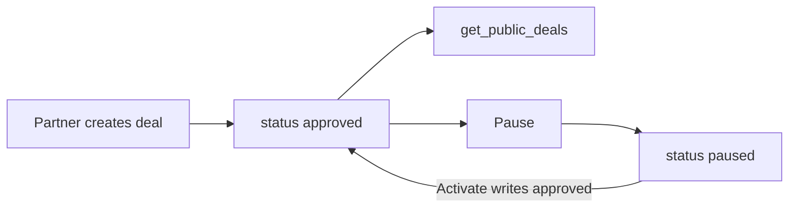

# Website implementation plan

**What to do next:** [REMAINING_WORK.md](REMAINING_WORK.md) (website leftovers, then the app). This file is the locked product rules; phases 0–4 are already in code.

Website-only. Shared Supabase. Do not change the mobile app in this work.

Local/uncommitted files and SQL not run in Supabase do not count as shipped.

## Locked rules

1. **Partner-created deals need no admin approval.** Insert `status: "approved"`. Live immediately, or Coming Soon until `start_time`. Never add a deal Pending/Approve queue.
2. **Admin approval stays only for** student verification and **events** (not deals).
3. **Transactional mail** From is `Uni Deals <support@updates.unideals.co>` (send-only, not monitored). Reply-To / human contact is `unideals.lk@gmail.com`. Never revive `help@unideals.lk`.
4. **Nobody is a verified student until an admin approves.** OTP proves inbox ownership only.

| Action | Status to write | Admin needed? |
|--------|-----------------|---------------|
| Partner creates deal | `approved` | **No** |
| Partner/admin pauses | `paused` | Pause is ops, not approval |
| Activate / unpause | `approved` (not `active`) | No — just unpause |
| Coming Soon start in future | still `approved`; hidden until start | No |
| Student / club **event** | `pending` until admin event moderation | **Yes** (events only) |
| Student **verification** | admin approve | **Yes** (students only) |

---

## Phase 0 — Finish student verification

Do not rebuild. Finish existing local files, then run SQL and redeploy.

**Code already in the tree:**

- `src/lib/studentEmailDomain.js`
- `src/components/StudentVerificationCard.jsx` on Profile
- `src/pages/admin/AdminVerifications.jsx` two queues
- `supabase/functions/_shared/mail.ts`
- `supabase/functions/send-verification-rejected/index.ts`
- `supabase_student_verification_admin_gate.sql`
- OAuth `src/pages/AuthCallback.jsx` + `src/lib/authRedirect.js`

**Run outside the repo:**

1. Apply `supabase_student_verification_admin_gate.sql` (subdomain domains; OTP must **not** set `is_verified`). Do not re-run older SQL that instant-verifies.
2. Redeploy `send-verification-otp`, `send-event-approved`, `send-inquiry-notification`, `send-verification-rejected`.
3. Allowlist `/auth/callback` (prod + localhost) in Supabase Auth.

---

## Phase 1 — Deal lifecycle (no approval)

- Keep `src/pages/partner/CreateDeal.jsx` `status: "approved"`. Keep “live” success copy (Coming Soon note if future start).
- `src/pages/admin/AdminAllDeals.jsx`: Activate/unpause writes `"approved"` not `"active"`. No Pending tab. No Approve/Reject.
- Leave `src/pages/admin/AdminDashboard.jsx` unrouted. Do not port its deal queue.
- Do not add Pending on `src/pages/partner/PartnerDeals.jsx`.

If the app still inserts `pending`, those deals stay hidden until `approved`. Align the app separately; this plan will not add website deal approval.

---

## Phase 2 — Redemption, store URL, validation

- `src/lib/comingSoon.js`: add `isExpiredDeal`.
- `src/pages/DealDetails.jsx`: expired wall — browse OK, no code/ticket (Coming Soon wall already exists).
- `src/lib/dealOffer.js`: `validateOfferValue` (percent 1–100, flat > 0) and `validateSchedule` (end ≥ start; end in future if no start). Wire CreateDeal + `src/pages/partner/EditDeal.jsx`.
- Create/Edit: optional Store URL when type is Online; persist `store_url` (`useDeals.js` already maps it).
- New `src/lib/httpUrl.js` `asHttpUrl` (`http`/`https` only) on deal store CTA and `src/pages/EventDetails.jsx` registration href.

---

## Phase 3 — Student QR pass (not the verification card)

- `src/pages/Profile.jsx`: students only, QR payload `unideals://student/{userId}`. Partners/admins keep portal. No ID photos on the pass. Keep `StudentVerificationCard` for unverified / in-flight / rejected.
- `src/pages/partner/PartnerScanner.jsx`: if payload starts with `unideals://student/`, tell them to open the deal and generate an in-store ticket. Do not call `validate_instore_ticket`.

---

## Phase 4 — Portal + copy

- `src/pages/partner/PartnerOverview.jsx`: redemption stats `.eq("partner_id", user.id)` not `.eq("brand", brandName)`.
- Profile brand form: TikTok input (`tiktok_handle` already load/saves).
- Rename **Current → Live** in `src/pages/Deals.jsx` and `src/pages/UniversityEvents.jsx`.
- `src/pages/Support.jsx`: FAQs for verify, redeem, submit event, partnerships. Contact stays Gmail — never `support@updates.unideals.co`.
- `src/pages/CreateEvent.jsx`: reject end before start.
- Admin users/deals: “Showing first N” when hit (100 / 500).
- Optional: `beforeunload` on dirty create/edit deal/event.

---

## Out of scope

Native camera, Expo deep links, app chrome, student blog reader, public brand directory, admin impersonation, support tickets, **admin approval for partner-created deals**, rewriting verification from scratch.

---

## Test checklist

- OTP on allowed domain waits for admin; Gmail/school use manual; reject mail From send-only + Reply-To Gmail
- Partner create → on `/deals` immediately (or Coming Soon) — **no** admin step
- Pause then Activate → status `approved`, deal back on student feed
- Coming Soon: no redeem; expired: ended wall, no redeem
- Store URL CTA only for http/https
- Profile student QR; scanning it does not validate as a ticket
- Invalid offer (0%, end before start) blocked on create/edit
